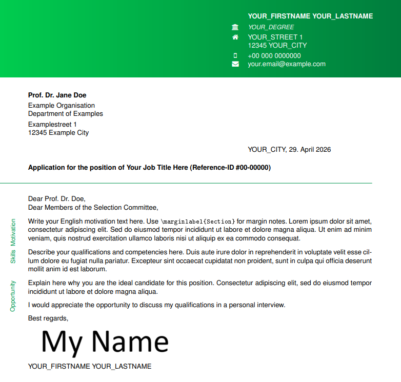
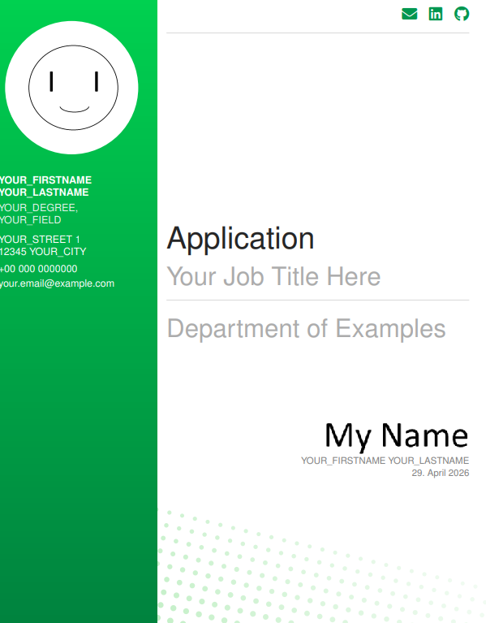
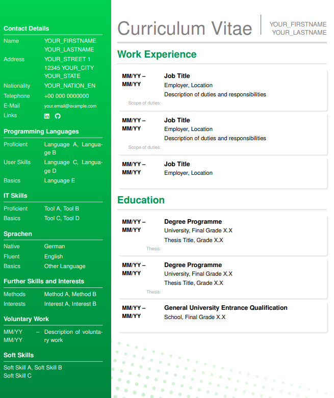
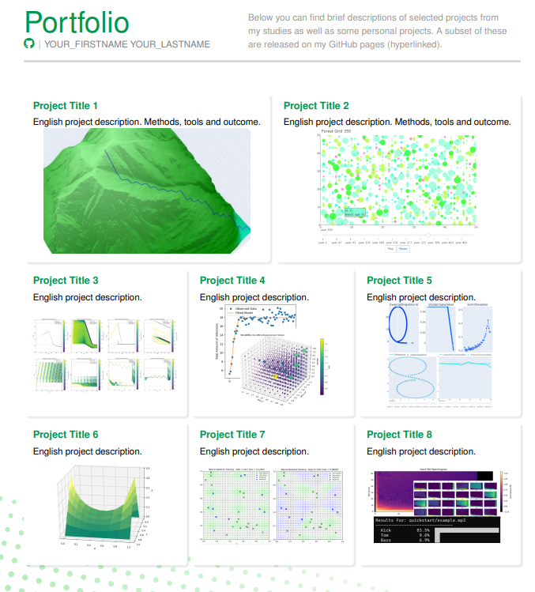
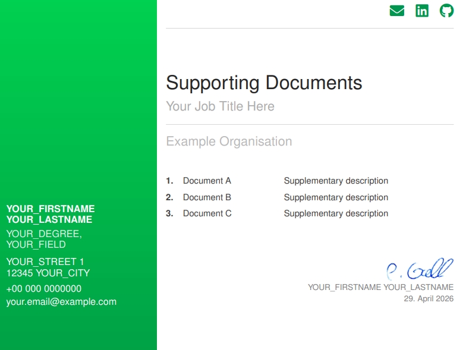
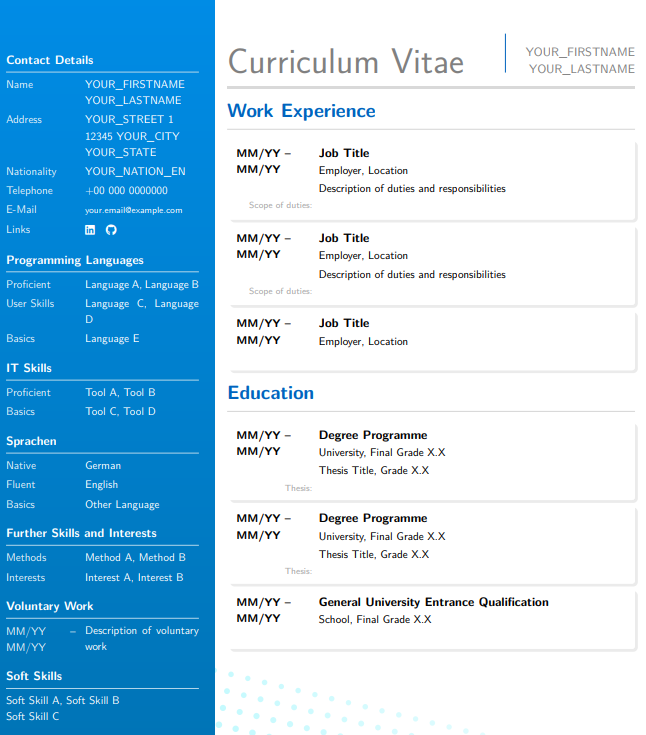

# LaTeX Application Template

A modular LaTeX template for job applications. The entire set of documents is driven by a single configuration file. For each new application you only need to edit `_ConfigDetails.tex`. Use `_Compile.bat` to compile all files on Windows.

## Previews
 
| | | |
|---|---|---|
|  |  |  |
| Cover Letter | Cover Page | Curriculum Vitae |
|  |  |  |
| Project Portfolio | Supporting Documents | Blue / Font Alternative |

## Documents

| File | Output |
|---|---|
| `_ConfigDetails.tex` | Configuration only - not compiled directly |
| `00_Cover_Letter.tex` | Cover letter with gradient header and margin labels |
| `01_Cover.tex` | Cover / title page with sidebar and profile photo |
| `02_Curriculum_Vitae.tex` | Two-column CV with coloured sidebar |
| `03_Project_Portfolio.tex` | Card-grid project portfolio |
| `04_Supporting_Documents.tex` | Enclosures index page with sidebar |

## Quick Start

1. Copy the repository.
2. Add your images to the `Images/` folder (see below).
3. Open `_ConfigDetails.tex` and fill in every `YOUR_*` placeholder.
4. Compile each document with `pdflatex` (run twice for correct overlays).

> **Cover letter only:** `00_Cover_Letter.tex` must be compiled with `pdflatex` because `\input{_ConfigDetails.tex}` is placed *before* `\documentclass` to expose `\Fontsize` as a class option. This is standard behaviour for plain `pdflatex`; it does not work with `latexmk`'s default pre-scan unless you pass `-pdflatex="pdflatex %O %S"`.

## Required Images

Place all images in an `Images/` subfolder next to the `.tex` files.

### Always required

| File | Used in | Description |
|---|---|---|
| `Images/Signature.png` | 00, 01, 02, 04 | Your handwritten signature on a transparent or white background. Recommended width ≥ 400 px. |
| `Images/Profile.jpg` | 01, 02 | Portrait photo. Will be clipped to a circle of radius 27 mm. Square crop recommended. |
| `Images/Background_Green.pdf` | 01, 02, 03, 04 (when `\colorway{green}`) | Full-page decorative background at A4 size. Can be a blank white page if you want no background texture. |
| `Images/Background_Blue.pdf` | 01, 02, 03, 04 (when `\colorway{blue}`) | Same as above for the blue colour scheme. |

### Portfolio images (03 only)

One preview image per project card. The template ships with eight placeholder slots; add or remove cards freely.

| File | Card |
|---|---|
| `Images/Portfolio_Project1.png` | Grid 1, card 1 |
| `Images/Portfolio_Project2.png` | Grid 1, card 2 |
| `Images/Portfolio_Project3.png` | Grid 2, card 1 |
| `Images/Portfolio_Project4.png` | Grid 2, card 2 |
| `Images/Portfolio_Project5.png` | Grid 2, card 3 |
| `Images/Portfolio_Project6.png` | Grid 3, card 1 |
| `Images/Portfolio_Project7.png` | Grid 3, card 2 |
| `Images/Portfolio_Project8.png` | Grid 3, card 3 |

Images are scaled to fill the card width while preserving aspect ratio. Landscape images work best.

## Configuration Reference (`_ConfigDetails.tex`)

### Appearance

| Macro | Options | Effect |
|---|---|---|
| `\ApplicationLanguage` | `ger` / `eng` | Switches all static labels and selects `\applicationcontentger` or `\applicationcontenteng` |
| `\Fonttype` | `h` / `c` | Helvetica (sans) or CMU Sans Serif |
| `\Fontsize` | `9pt` / `10pt` / `11pt` | Base font size - also affects spacing compensation in the cover letter |
| `\colorway` | `green` / `blue` | Selects one of the two predefined colour palettes |

### Colours

Eight RGB `\def`s define the two palettes. Edit to taste - `\definecolor` is called in each document after `xcolor` is loaded, so there is no load-order conflict.

```latex
\def\highlightcolorgreenRGB{0,150, 80}
\def\gradientstartgreenRGB {0,210, 80}
% ... etc.
```

### Recipient & Position

```latex
\def\recipientname  {Prof. Dr. Jane Doe}
\def\recipientorg   {Example Organisation}
\def\recipientdept  {Department of Examples}
\def\recipientstreet{Examplestreet 1}
\def\recipientcity  {12345 Example City}
\def\refID          {\#00-00000}
\def\jobtitle       {Your Job Title Here}
```

### Personal Data

```latex
\def\myname         {YOUR_FIRSTNAME YOUR_LASTNAME}
\def\mydegree       {YOUR_DEGREE}
\def\mystreet       {YOUR_STREET 1}
\def\mycity         {12345 YOUR_CITY}
\def\mystate        {YOUR_STATE}
\def\myphone        {+00 000 0000000}
\def\myemail        {your.email@example.com}
\def\myGitHub       {https://github.com/YOUR_USERNAME}
\def\myLinkedIn     {https://linkedin.com/in/YOUR_USERNAME}
```

## Required Packages

The template uses standard CTAN packages. Install a full TeX Live or MiKTeX distribution and all dependencies will be present.

- `extarticle` (cover letter only - for sub-10pt base sizes)
- `xcolor` with `[dvipsnames]`
- `tikz` + libraries `calc`, `shadows`
- `eso-pic`
- `tcolorbox` with `[most]`
- `hyperref`
- `fontawesome` (cover letter) / `fontawesome5` (all other documents)
- `etoolbox`
- `helvet` or `lmodern` (depending on `\Fonttype`)
- `geometry`, `parskip`, `graphicx`, `array`, `calc`
- `inputenc`, `fontenc`, `babel`

## Bilingual Support

Use `\langGerEn{german text}{english text}` anywhere in the document body. The active language is controlled by `\ApplicationLanguage` in `_ConfigDetails.tex`.

## License

MIT - use freely, attribution appreciated but not required.
